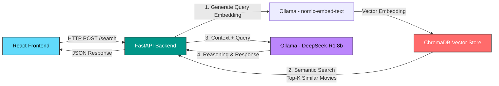

# 🎬 CineMatch AI

An intelligent RAG-based movie recommendation system powered by semantic search and DeepSeek-R1 reasoning. CineMatch AI combines ChromaDB's vector store with advanced language models to deliver contextually relevant movie recommendations through natural language queries.

## ✨ System Architecture

The application follows a modern RAG (Retrieval-Augmented Generation) architecture with clear separation between frontend, backend, and AI layers:



**Flow Breakdown:**
1. User submits a natural language query via React UI
2. FastAPI backend converts query to vector embedding using `nomic-embed-text`
3. ChromaDB performs cosine similarity search and retrieves top-3 relevant movies
4. Retrieved movies are sent as context to DeepSeek-R1 for intelligent filtering and recommendation
5. DeepSeek analyzes relevance and generates personalized recommendations in Turkish
6. Results are rendered in the frontend with AI reasoning and raw database matches

## 🛠️ Tech Stack

| Layer | Technologies |
|-------|-------------|
| **Frontend** | React 19, Tailwind CSS v4, Vite |
| **Backend** | FastAPI, Python, Uvicorn |
| **AI & Embeddings** | Ollama (DeepSeek-R1:8b, nomic-embed-text) |
| **Vector Database** | ChromaDB (Persistent, Cosine Similarity) |
| **Data Processing** | Pandas, NumPy, Sentence-Transformers |

## 📁 Project Structure

```
cinematch-ai/
│
├── backend/
│   ├── main.py                 # FastAPI application with /search endpoint
│   ├── vector_store.py         # ChromaDB wrapper and embedding logic
│   ├── ingest.py               # Movie data ingestion pipeline
│   ├── labeler.py              # Data preprocessing and enrichment
│   ├── rebuild_db.py           # Database rebuild utility
│   ├── test_search.py          # Vector search testing script
│   ├── inspect_db.py           # Database inspection tool
│   ├── requirements.txt        # Python dependencies
│   └── venv/                   # Python virtual environment
│
├── frontend/
│   ├── src/
│   │   ├── App.jsx             # Main React component
│   │   ├── App.css             # Component styles
│   │   ├── index.css           # Global styles + Tailwind directives
│   │   └── main.jsx            # React entry point
│   ├── public/                 # Static assets
│   ├── package.json            # Node dependencies
│   ├── vite.config.js          # Vite configuration
│   ├── tailwind.config.js      # Tailwind CSS v4 config
│   └── postcss.config.js       # PostCSS settings
│
└── data/
    ├── movies.csv              # Original Kaggle movie dataset
    ├── movies_processed.csv    # Cleaned and enriched data
    └── chroma_db/              # ChromaDB persistent storage
```

## 🚀 Installation & Setup

### Prerequisites
- Python 3.10+
- Node.js 18+
- [Ollama](https://ollama.ai/) installed locally

### Step 1: Clone the Repository
```bash
git clone https://github.com/ns-ylmz/cinematch-ai.git
cd cinematch-ai
```

### Step 2: Backend Setup

#### 2.1 Create Python Virtual Environment
```bash
cd backend
python3 -m venv venv
source venv/bin/activate  # On Windows: venv\Scripts\activate
```

#### 2.2 Install Dependencies
```bash
pip install -r requirements.txt
```

#### 2.3 Download Ollama Models
```bash
ollama pull nomic-embed-text
ollama pull deepseek-r1:8b
```

#### 2.4 Initialize Vector Database
```bash
# Process movie data and create embeddings
python ingest.py
```

#### 2.5 Start FastAPI Server
```bash
# Development mode with auto-reload
uvicorn main:app --reload --host 0.0.0.0 --port 8000

# Or run directly
python main.py
```

The API will be available at `http://localhost:8000`  
API documentation: `http://localhost:8000/docs`

### Step 3: Frontend Setup

#### 3.1 Install Node Dependencies
```bash
cd ../frontend
npm install
```

#### 3.2 Start Development Server
```bash
npm run dev
```

The frontend will be available at `http://localhost:5173`

### Step 4: Test the Application
1. Open `http://localhost:5173` in your browser
2. Enter a query like "Crime and Power" or "Romantic comedy from the 90s"
3. Watch the AI analyze and recommend movies!

## 🗺️ Roadmap

- [x] **Phase 1: Core RAG Pipeline** - Integration of ChromaDB semantic search with DeepSeek-R1 reasoning engine
- [x] **Phase 2: Modern Dashboard** - Responsive dark-mode UI built with Tailwind CSS v4 and React 19
- [ ] **Phase 3: Performance Optimization (High Priority)** - Implementing Server-Sent Events (SSE) for real-time token streaming to eliminate long LLM waiting times
- [ ] **Phase 4: Visual Enrichment** - TMDB API integration to fetch and display dynamic movie posters and trailers
- [ ] **Phase 5: Advanced Search & Filtering** - Hybrid search combining metadata filtering with semantic similarity
- [ ] **Phase 6: Model Fine-Tuning** - Training/Fine-tuning the model on specialized movie datasets for better domain-specific responses

## 🧪 API Reference

### POST `/search`

**Request:**
```json
{
  "query": "Science fiction with time travel"
}
```

**Response:**
```json
{
  "user_query": "Science fiction with time travel",
  "recommended_movies": "DeepSeek AI-generated analysis and recommendations...",
  "raw_data_source": [
    {
      "title": "Interstellar",
      "release_date": "2014-11-07",
      "vote_average": 8.3
    }
  ]
}
```

## 🤝 Contributing

Contributions are welcome! Please follow these steps:
1. Fork the repository
2. Create a feature branch (`git checkout -b feature/amazing-feature`)
3. Commit your changes (`git commit -m 'Add amazing feature'`)
4. Push to the branch (`git push origin feature/amazing-feature`)
5. Open a Pull Request

## 📄 License

This project is open source and available under the [MIT License](LICENSE).

## 🙏 Acknowledgments

- **ChromaDB** - Vector database for semantic search
- **Ollama** - Local LLM inference engine
- **DeepSeek-R1** - Advanced reasoning capabilities
- **Kaggle** - Movie dataset source

---

Built with ❤️ using RAG architecture and modern web technologies